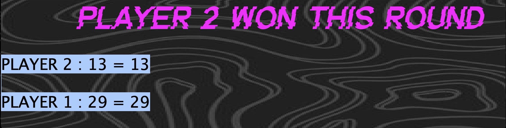
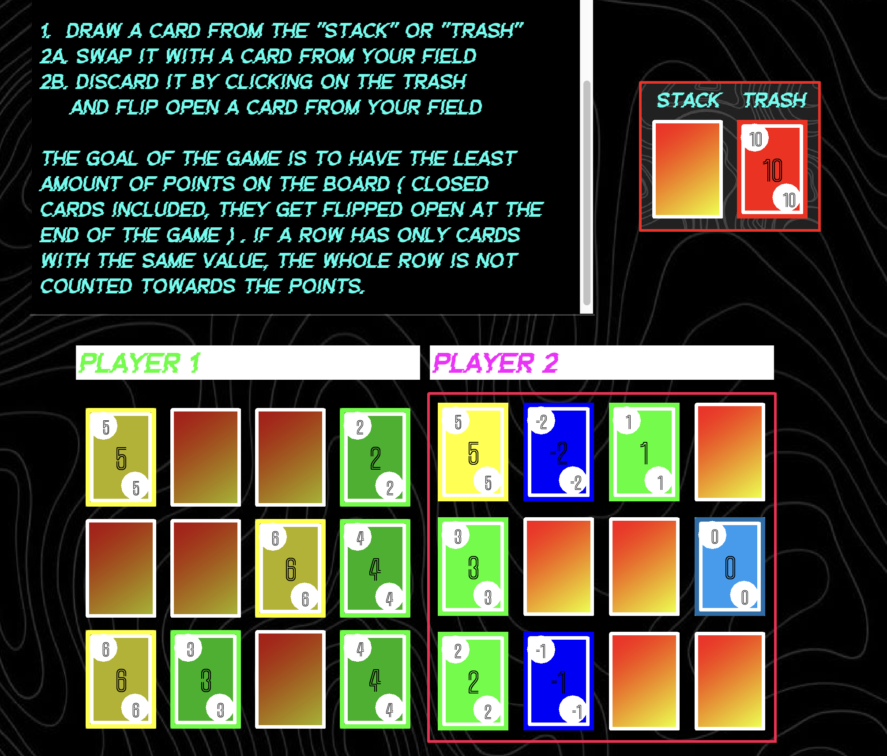

## Skyjo

 **How to play:**

 1.  Draw a card from the ''Stack'' or ''Trash''
 2a. Swap it with a card from your Field
 2b. Discard it by clicking on the trash
     and flip open a card from your Field

 The goal of the game is to have the least amount of points on the board 
 (closed cards included, they get flipped open at the end of the game). 
 If a row has only cards with the same value, the whole row is not counted towards the points.

 # My Game Project

## Screenshots

### Finish Screen

### Game Screen

